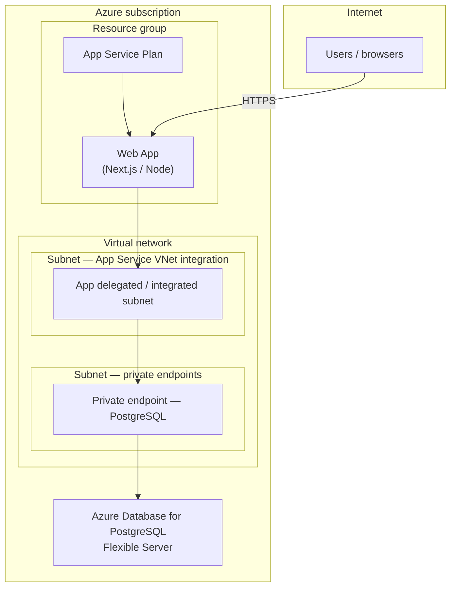
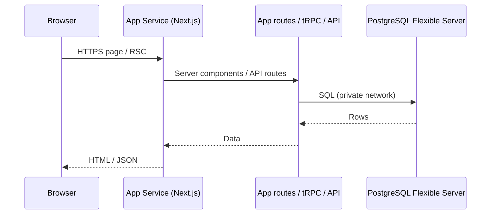
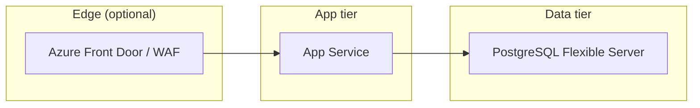

# Production architecture (Azure)

Target deployment for the production product: **Azure App Service** for the web app, **Azure Database for PostgreSQL – Flexible Server** for data, with **VNet** integration and **private connectivity** to the database (private endpoint or private access patterns).

## Network and compute (high level)

Notes:

- **App Service** exposes **HTTPS** publicly (or via Front Door / Application Gateway if you add one later).
- **VNet integration** places outbound traffic from the app in your VNet so it can reach **private endpoints** on approved subnets.
- **Flexible Server** should be configured for **private access** (private endpoint to the server, or VNet-integrated flexible server networking—follow current Azure guidance for your chosen pattern). The diagram shows the common **private endpoint** model.

## Request path (application)

## Segmentation (optional hardening)

Use this when you need global routing, WAF rules, or TLS at the edge in addition to App Service.

## Environment configuration

Conceptually, the app needs (among other variables):

| Concern | Example |
|--------|---------|
| Database URL | PostgreSQL connection string targeting the **private** hostname of Flexible Server (via private DNS zone linked to the VNet). |
| Org tenancy | e.g. `METRIQ_ORG_SLUG` matching seeded `company.slug` for workspace resolution. |
| Secrets | Stored in **Key Vault** references on App Service settings (recommended). |

No diagram replaces Azure’s current networking blades—validate subnet sizing, DNS zones for private endpoints, and Flexible Server **networking mode** in the portal before go-live.
