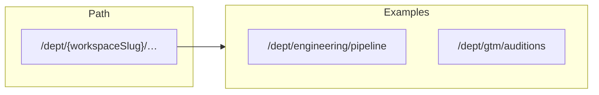
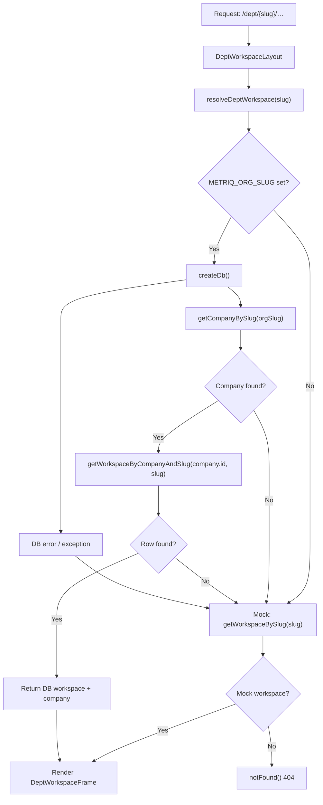
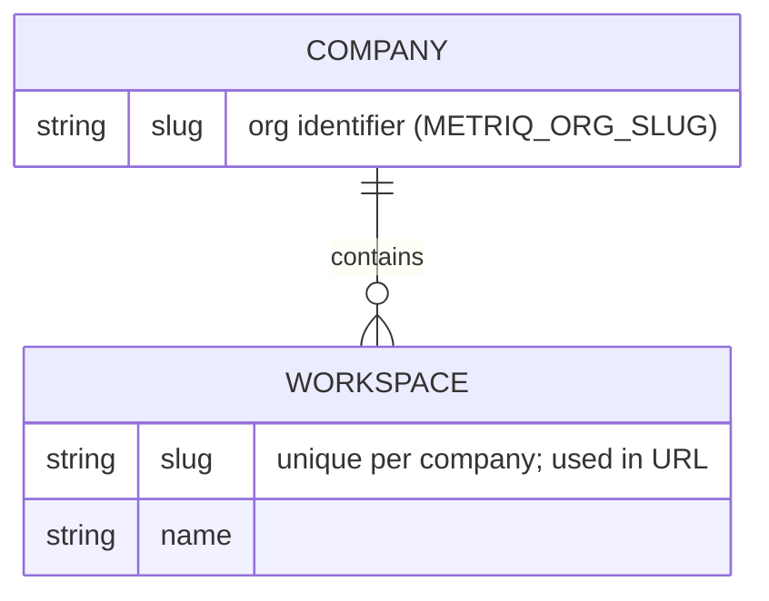
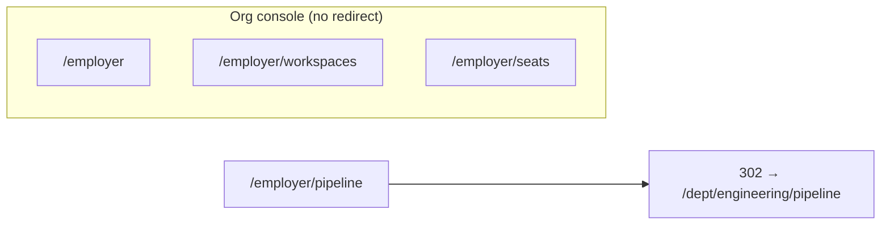

# Workspace slug (`/dept/[workspaceSlug]`)

How the **department workspace slug** participates in routing, resolution, and data scope.

## URL shape

The slug is the **second segment** after `/dept/`. Client code builds these paths with helpers such as `deptPath(workspaceSlug, path)` (`apps/web/src/lib/dept-path.ts`).

## Resolution flow

When a page under `apps/web/src/app/dept/[workspaceSlug]/` loads, the layout resolves the slug to a workspace (database row or mock fallback).

## Data model (conceptual)

In Postgres, the workspace slug is scoped by **company** (`company_id` + `slug`), matching the URL segment under `/dept/[workspaceSlug]`.

## Legacy employer URLs

Non–org-console paths under `/employer/...` redirect to the **default workspace** slug (e.g. `engineering`) under `/dept/{slug}/...`, preserving the path suffix. See `apps/web/middleware.ts`.

