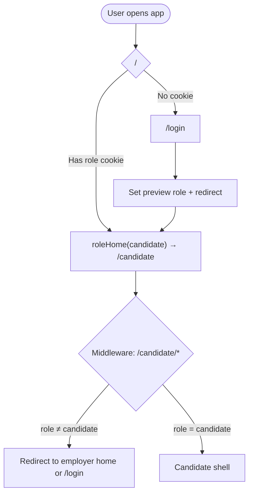
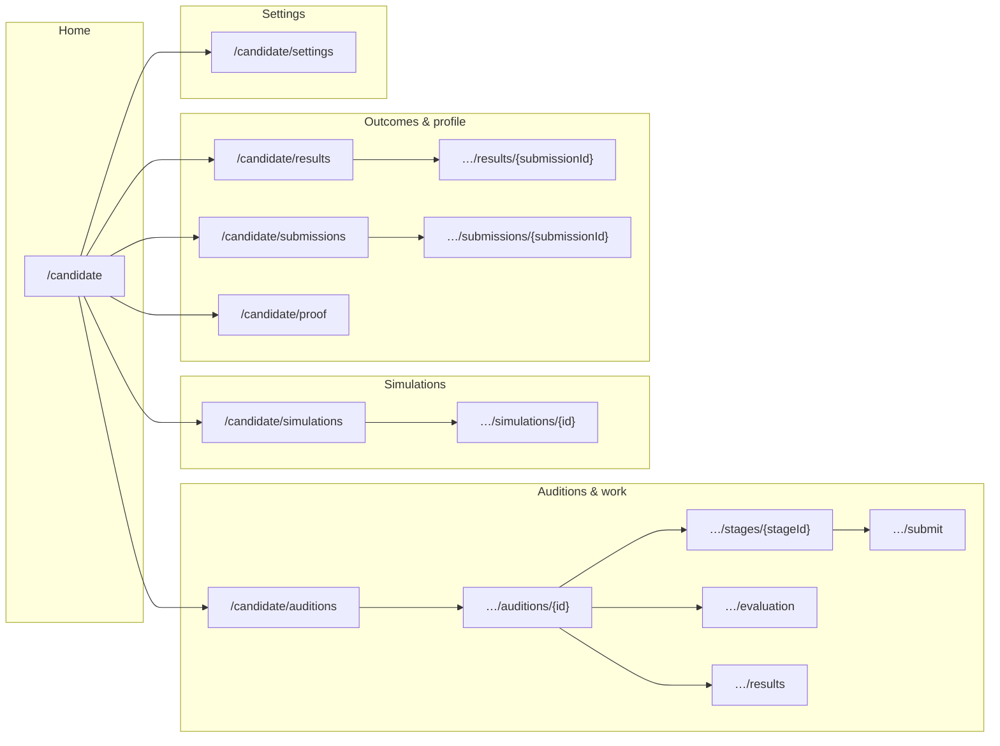
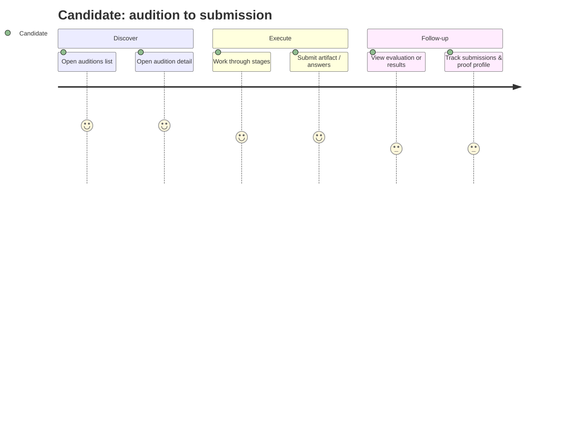

# Candidate UX flow

High-level journey for the **candidate** area (`/candidate/*`). Access is enforced by preview **role cookie** middleware (`metriq.role=candidate`); non-candidates are redirected to their home or login.

## Entry and guard

## Primary navigation (screens)

## Typical audition loop

