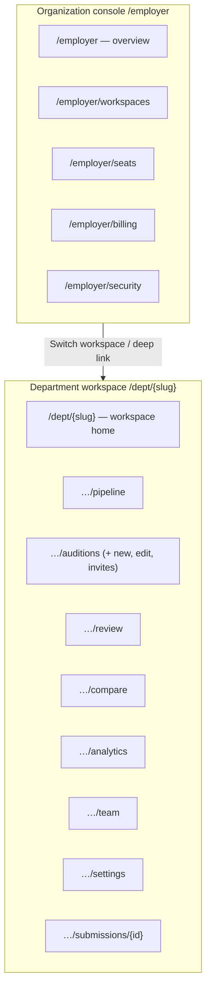
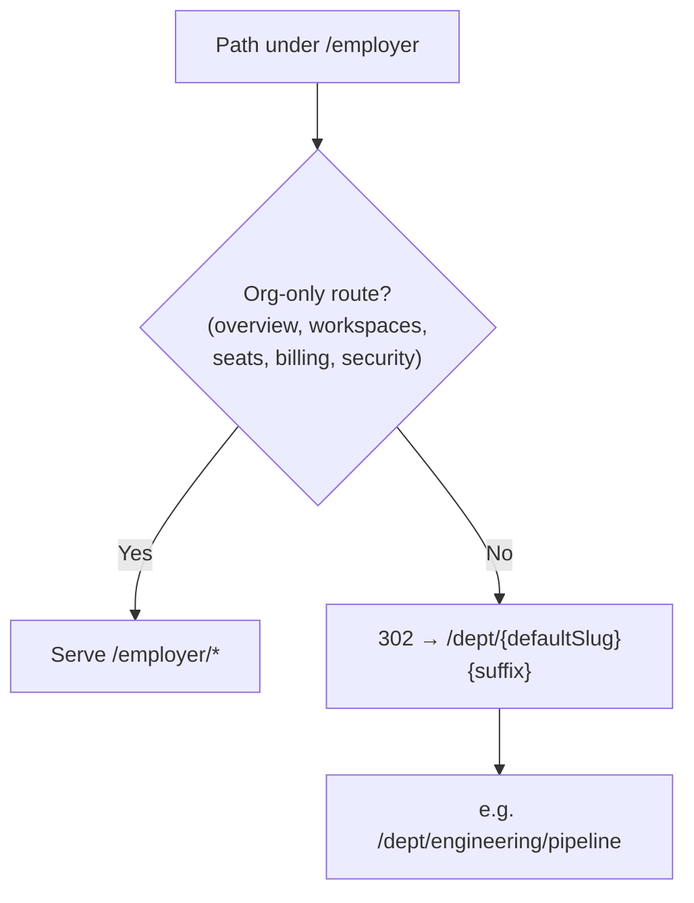
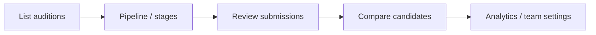
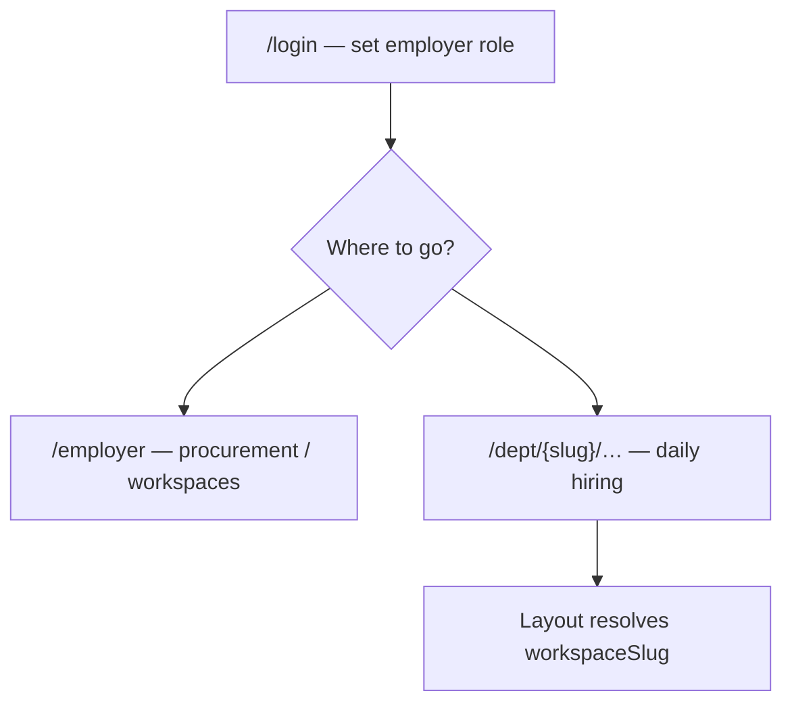

# Employer UX flow

High-level journey for **employer** users: **organization console** (`/employer/*`) vs **department workspace** (`/dept/[workspaceSlug]/*`). Middleware requires `metriq.role=employer` for both.

## Two surfaces

## Middleware: legacy `/employer` app paths → default workspace

Operational URLs that used to live under `/employer/...` (except the org console routes) **redirect** to `/dept/{DEFAULT_WORKSPACE_SLUG}/...` so bookmarks and shared links stay stable.

Default slug is defined in mocks (`DEFAULT_WORKSPACE_SLUG`, e.g. `engineering`) and used by `apps/web/middleware.ts`.

## Day-to-day hiring loop (department)

## Entry from login

