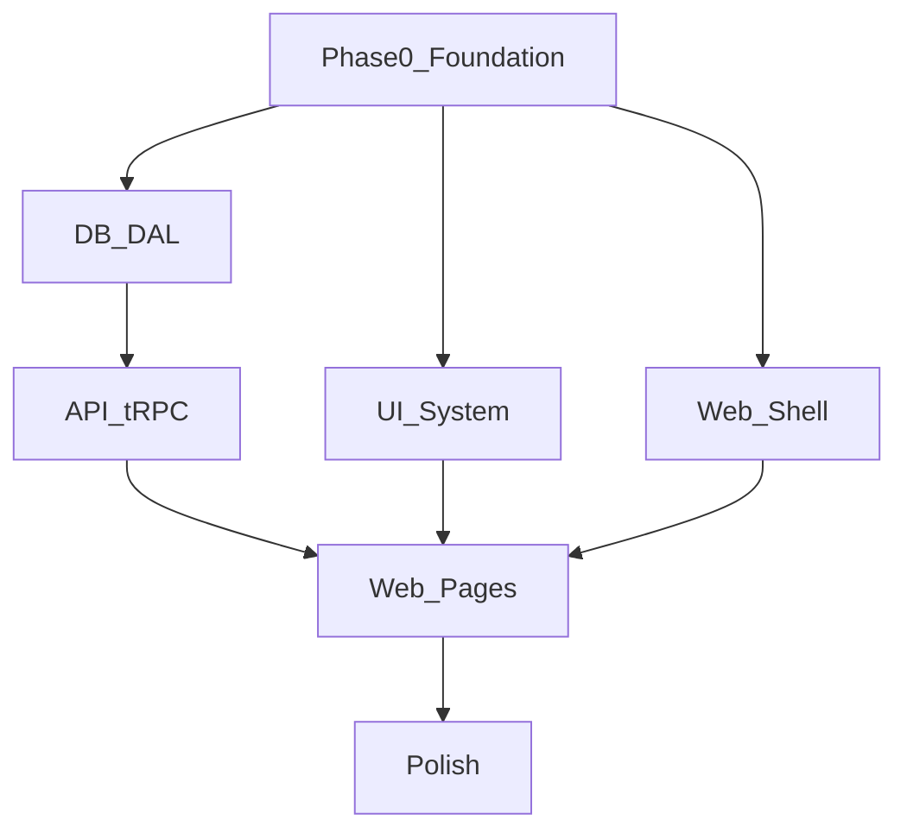

# Metriq MVP phased implementation plan

## Spec constraints to enforce throughout
- **Stack is fixed**: Next.js (App Router) + TypeScript + Tailwind + shadcn/ui + Zustand + tRPC + pnpm workspaces + Zod + PostgreSQL + **Kysely (no Prisma)**.
- **No auth**: only a **mock role switcher** (candidate/employer/admin). Architecture should allow swapping in real auth later.
- **Multi-tenancy aware**: don’t implement tenancy, but design models so adding `tenantId` later is trivial (clean ownership boundaries: company/employer/candidate/data).
- **DB access discipline**: Kysely everywhere; **domain-grouped DAL**; no scattered SQL.
- **Validation discipline**: shared Zod schemas; no duplication.
- **UI discipline**: enterprise-grade look; reusable prop-driven components; loading/empty states; high-quality tables.
- **File size discipline**: keep files ~300–350 LOC by splitting modules.

## Target monorepo structure (mandatory)
- **App**
  - `[apps/web](apps/web)`: Next.js app (App Router). Contains routes/pages, route-level server wiring for tRPC, and UI composition only.
- **Packages**
  - `[packages/db](packages/db)`: Kysely instance, schema types, migrations, seed, and **domain query modules**.
  - `[packages/api](packages/api)`: tRPC server (routers + procedures), integrates DAL, exposes typed API to web.
  - `[packages/ui](packages/ui)`: design system + shared components (shadcn/ui wrappers + Metriq components).
  - `[packages/validators](packages/validators)`: shared Zod schemas (inputs/filters/forms), used by API + web.
  - `[packages/types](packages/types)`: shared domain types (non-DB), enums, utility types.
  - `[packages/config](packages/config)`: shared config (Tailwind preset, eslint/tsconfig bases, env schema helpers if needed).

## Package responsibilities and boundaries
### `packages/db`
- **Owns**: Postgres schema (migrations), Kysely `Database` typing, and DAL functions.
- **Exports**:
  - `db.ts`: Kysely instance factory/config.
  - `types.ts`: `Database` interface (tables + columns) used by Kysely.
  - `queries/*`: domain query modules (no cross-domain duplication).
  - `migrations/*` and `seed/*`.
- **Does not own**: business rules for UI/role; request validation (that lives in validators/api).

Suggested domain query modules (aligning to spec example and entities):
- `[packages/db/queries/candidate.ts](packages/db/queries/candidate.ts)`
- `[packages/db/queries/employer.ts](packages/db/queries/employer.ts)`
- `[packages/db/queries/company.ts](packages/db/queries/company.ts)`
- `[packages/db/queries/simulation.ts](packages/db/queries/simulation.ts)`
- `[packages/db/queries/submission.ts](packages/db/queries/submission.ts)`
- `[packages/db/queries/rubric.ts](packages/db/queries/rubric.ts)`
- `[packages/db/queries/evaluation.ts](packages/db/queries/evaluation.ts)`

### `packages/validators`
- **Owns**: Zod schemas for all procedure inputs and UI forms.
- **Exports**:
  - candidate profile schema
  - simulation creation schema
  - submission schema
  - filter/sort schemas used in employer talent pool

### `packages/api`
- **Owns**: tRPC router tree + procedure composition + mapping between validators and DAL.
- **Routers (mandatory)**:
  - `candidateRouter`
  - `employerRouter`
  - `simulationRouter`
  - `submissionRouter`
  - `adminRouter`
- **Rules**:
  - No UI logic.
  - No raw SQL.
  - Zod validation at the boundary.
  - Procedures stay focused (one job each) and call DAL.

### `packages/ui`
- **Owns**: reusable components and design primitives.
- **Exports**: prop-driven building blocks used by routes across roles.

### `apps/web`
- **Owns**: route structure, role-aware navigation/layout composition, and calling tRPC.
- **State**: Zustand only for **role switcher**, UI state (filters/sorting), simulation progress, view prefs.
- **Does not**: store server data globally in Zustand.

## Kysely schema + domain model (entities + relationships)
Core entities from spec:
- `candidate`, `employer`, `company`
- `simulation`, `simulation_section`
- `rubric`, `rubric_criterion`
- `submission`, `submission_artifact`
- `evaluation`, `score_breakdown`

Recommended relationship design (multi-tenancy aware without implementing it):
- **Company ownership**
  - `company` is the root for employer-side ownership.
  - `employer.companyId -> company.id`
- **Candidate independence**
  - `candidate` exists independently (later can be associated to tenants if needed).
- **Simulations**
  - `simulation` created by admin (and later could be tenant-scoped); contains metadata (title, type, difficulty, estimatedTime, skills).
  - `simulation_section.simulationId -> simulation.id` (ordered sections, prompt/instructions, required artifacts)
- **Rubrics**
  - `rubric.simulationId -> simulation.id`
  - `rubric_criterion.rubricId -> rubric.id` (criterion name, weight, description)
- **Submissions**
  - `submission.simulationId -> simulation.id`
  - `submission.candidateId -> candidate.id`
  - `submission.status` (draft/submitted)
  - `submission_artifact.submissionId -> submission.id` (type: link/text/fileRef; content)
- **Evaluation**
  - `evaluation.submissionId -> submission.id`
  - `evaluation.overallScore` + `evaluation.summary`
  - `score_breakdown.evaluationId -> evaluation.id` and `score_breakdown.criterionId -> rubric_criterion.id`

Future `tenantId` accommodation:
- Keep every “ownable” table shape ready for `tenantId` by:
  - using consistent foreign keys through `companyId`/`createdBy` now
  - centralizing all “scoping” logic in DAL query helpers (so adding `tenantId` becomes a single cross-cutting filter update)

## tRPC router boundaries (what goes where)
- **candidateRouter**
  - `getDashboard` (overview metrics)
  - `listActiveSimulations` / `listCompletedSimulations`
  - `getProfile` / `updateProfile`
  - `getPerformanceMetrics`
- **simulationRouter**
  - `listSimulations` (browse)
  - `getSimulationDetail`
  - `startSimulation` (creates draft submission)
- **submissionRouter**
  - `getSubmission`
  - `saveArtifact` / `removeArtifact`
  - `submitSubmission`
  - `getResult` (evaluation + breakdown)
- **employerRouter**
  - `listTalentPool` (filters/sort/pagination)
  - `getCandidateProfile`
  - `getCandidateSubmissions` / `getSubmissionArtifacts`
  - `getCandidateScoreBreakdown`
- **adminRouter**
  - `listSimulations` / `createSimulation` / `updateSimulation`
  - `manageRubric` (create/update rubric + criteria)
  - `listSubmissions` / `reviewSubmission`
  - (MVP) `createEvaluation` / `updateEvaluation` (manual scoring to start)

Note on “no auth”:
- Each procedure can accept a `role` from the mock role context (fed by Zustand in the web app) and enforce role gates server-side.

## UI component system (shared, prop-driven)
Build in `packages/ui` so pages compose features without tight coupling.

Base primitives (from shadcn/ui + wrappers):
- Layout: `PageHeader`, `SectionHeader`, `AppShell`, `SidebarNav`, `TopNav`
- Feedback: `EmptyState`, `LoadingState`, `Skeletons`, `Toast` hooks
- Data display: `DataTable`, `StatCard` (metric cards), `Badge` variants, `ProgressBar`, `ScoreBadge`
- Filters: `FilterPanel`, `SearchInput`, `SegmentedControl`, `SortMenu`
- Detail: `DetailRow`, `DefinitionList`, `Tabs`, `Drawer/Modal`
- Domain-specific:
  - `SimulationCard`, `SimulationStatusPill`
  - `SubmissionArtifactViewer` (text/link viewer)
  - `EvaluationBreakdown` (criterion list with scores)

## Next.js App Router route structure
Role-oriented route groups with shared shell/layout.

Suggested routes in `[apps/web/app](apps/web/app)`:
- `(app)/layout.tsx` – app shell, nav, role switcher
- `(app)/candidate/*`
  - `candidate/page.tsx` (dashboard)
  - `candidate/simulations/page.tsx` (browse)
  - `candidate/simulations/[simulationId]/page.tsx` (detail/start)
  - `candidate/submissions/[submissionId]/page.tsx` (work area)
  - `candidate/results/[submissionId]/page.tsx` (results)
- `(app)/employer/*`
  - `employer/page.tsx` (dashboard)
  - `employer/talent/page.tsx` (talent pool)
  - `employer/candidates/[candidateId]/page.tsx` (candidate profile + submissions)
  - `employer/submissions/[submissionId]/page.tsx` (submission detail)
- `(app)/admin/*`
  - `admin/page.tsx` (overview)
  - `admin/simulations/page.tsx` (manage)
  - `admin/simulations/new/page.tsx` (create)
  - `admin/simulations/[simulationId]/page.tsx` (edit)
  - `admin/rubrics/[simulationId]/page.tsx` (rubric editor)
  - `admin/submissions/page.tsx` (review queue)
  - `admin/submissions/[submissionId]/page.tsx` (review + evaluate)

## Phased implementation order (build foundation first)
### Phase 0 — Repo + shared foundations
- Create pnpm workspace and baseline tooling under `[packages/config](packages/config)` (tsconfig bases, shared lint/format config if present in project conventions).
- Wire `packages/types` + `packages/validators` exports.
- Stand up `packages/ui` with Tailwind + shadcn/ui setup and a minimal app shell component.

### Phase 1 — Database + DAL (Kysely)
- Define DB tables/types in `[packages/db/types.ts](packages/db/types.ts)`.
- Create Kysely instance in `[packages/db/db.ts](packages/db/db.ts)`.
- Add migrations in `[packages/db/migrations](packages/db/migrations)`.
- Implement domain query modules in `[packages/db/queries](packages/db/queries)`.
- Add realistic seed data in `[packages/db/seed](packages/db/seed)` for candidates, employers/companies, simulations, submissions, evaluations/scores.

### Phase 2 — API (tRPC) with strict boundaries
- Define tRPC context and router composition in `[packages/api](packages/api)`.
- Implement the required routers with Zod inputs from `packages/validators` and DAL calls from `packages/db`.
- Keep procedures small; extract shared helpers when repeated.

### Phase 3 — Web app wiring + navigation
- Set up tRPC client/provider in `[apps/web](apps/web)`.
- Implement Zustand role switcher store (mock auth) + role-aware navigation.
- Build base layouts and route groups.

### Phase 4 — Candidate experience (end-to-end happy path)
- Candidate dashboard (metrics + active/completed + recent scores).
- Browse simulations → simulation detail → start simulation (draft submission).
- Submission work area (artifact entry) → submit.
- Results page (evaluation + breakdown).

### Phase 5 — Employer experience
- Employer dashboard.
- Talent pool table with filters/search/sorting (UI state in Zustand, server data via tRPC).
- Candidate profile detail with submission artifacts and score breakdown.

### Phase 6 — Admin experience
- Simulation management CRUD.
- Rubric management (criteria + weights).
- Submission review queue + manual evaluation entry to produce score breakdown.

### Phase 7 — Polish + production-grade UX
- Loading/empty states everywhere.
- Table UX improvements (pagination, column management if needed).
- Consistent typography/spacing, subtle borders, and layout rhythm.
- Basic error handling patterns in API and UI.

## Parallelizable workstreams (what can be built concurrently)
Once Phase 0 foundations are in place (workspace + shared packages), the following can proceed in parallel:
- **DB workstream**: migrations + Kysely `Database` typing + DAL query modules + seed data (`packages/db`).
- **API workstream**: router scaffolding + procedure contracts + Zod validators (`packages/api`, `packages/validators`). The API can stub against expected DAL signatures initially.
- **UI system workstream**: app shell + nav + reusable components + tables + empty/loading states (`packages/ui`).
- **Web routes workstream**: route structure + layouts + role switcher store + page skeletons using mocked tRPC calls (`apps/web`).

Critical dependency edges:
- API needs DB types/DAL signatures.
- Web pages need API procedure names/inputs.
- UI components can be built mostly independently, as long as prop contracts are agreed.

## Deliverable definition (matches spec “output expectation”)
By the end of the phases above, the repo will contain:
- Full monorepo structure per spec
- Core DB schema in Kysely typing + migrations
- Realistic seed data
- tRPC routers (candidate/employer/simulation/submission/admin)
- Key pages for all three roles
- Reusable UI component set
- Zustand role switcher (and limited UI state only)
- Clean, maintainable code respecting file size limits
